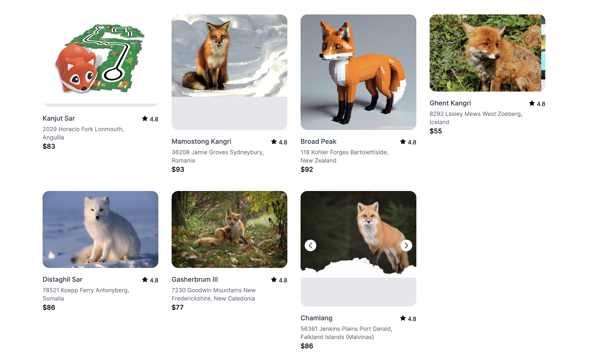

# `aspect-ratio`

The aspect-ratio property in CSS helps you maintain a specific aspect ratio for an element. It’s useful for ensuring that elements, like images or videos, retain their proportions regardless of their size.

```
 .swiper {
    aspect-ratio: 1/1;
 }
```

```
...
    <div class="swiper">
        <div class="swiper-wrapper">
        <% sight.images.each do |image| %>
            <%= image_tag image %>
        <% end %>
        </div>
    </div>
```

  
